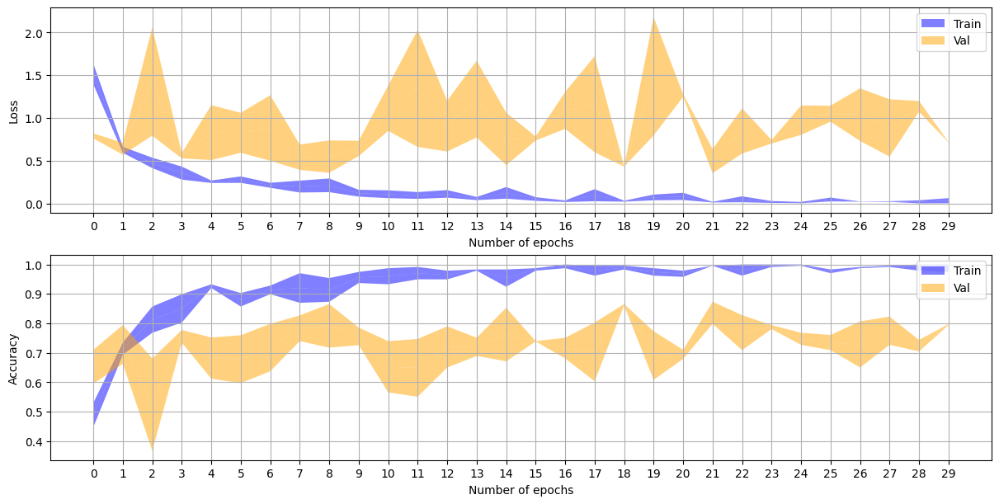
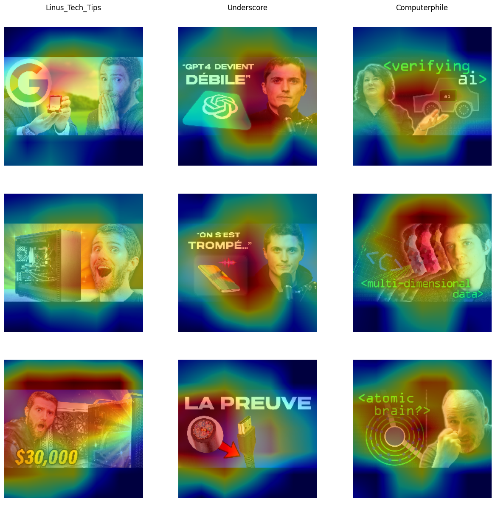

# Labo 5 - ARN
Auteurs: Felix Breval et Samuel Roland

## Introduction
<!-- 1. Introduction: describe the context of your application and its potential uses, brie y describe how you are going to proceed (methodology), that is, what data are you going to collect (your own pictures of.... , maybe extra-pictures collected from the web, etc), what methods are you going to use (e.g., CNNs, transfer learning) . -->
Notre modèle a pour but de classifier la chaîne YouTube à partir d'une vignette d'une de ses vidéos. Pour l'entrainement, nous allons nous baser sur le modèle existant MobileNetV2 et ses poids synaptiques (transfer learning). Les vignettes ne contenant pas fondamentalement de nouvelle caractéristique par rapport aux images de ImageNet (elles contiennent différents objets physiques, visages, personnes, textes, ...), nous estimons qu'il n'y a pas de nouvelle caractéristique à extraire et donc nous n'allons pas rajouter des couches de convolution. Nous allons juste rajouter nos couches de MLP à la fin pour qu'ils apprennent à classifier nos chaînes YouTube. Nous allons entrainer notre modèle grâce aux vignettes directement récupérée sur YouTube, c'est le plus simple, et après l'entrainement nous évaluerons la performance du modèle, ce qui reste confus pour lui et ce qu'il arrive correctement classifier.

## Le problème
<!-- 2. The problem: describe what are the classes you are learning to detect using a CNN, describe the database you collected, show the number of images per class or a histogram of classes (is it a balanced or an unbalanced dataset? Small or big Data ?) and provide some examples showing the intra-class diversity and the apparent di culty for providing a solution (inter-class similarity). -->

Nous avons sélectionné 3 chaînes YouTube liées à l'informatique:
**Underscore_**, chaîne de vulgarisation informatique en français, sous forme de talk show toutes les 2 semaines, crée par le Youtubeur Micode

**Computerphile**: chaîne anglophone qui parle de beaucoup de sujets geeks ou techniques dans la sécurité ou des curiosités mathématiques derrière des algorithmes


**Linus Tech Tips**: chaîne anglophone qui fait des review de matériels qui contient de la technologie tout genre


Comme on peut le voir en partie sur les vignettes au-dessus, elles contiennent


1. **Underscore_**: surtout souvent un bout de titre blanc, régulièrement un fond en teinte bleu foncé, régulièrement le visage de Micode (l'auteur) ou celui de 2-3 cohosts.
1. **Computerphile**: toujours un titre en lettre verte dans une police bien particulière, avec souvent un visage mais jamais le même
1. **Linus Tech Tips**: très souvent la tête de Linus avec un visage d'étonnement la bouche ouverte ou alors tout son corps, souvent accompagné d'un objet

Nous avons imaginé que certaines de ces caractéristiques qui reviennent constamment seraient utilisées par le modèle, nous verrons plus tard avec les résultats si c'est le cas ou non. Concernant la variété à l'interne d'une même classe, on voit que c'est bien diversifié: par ex. les vignettes d'Underscore_ ont différents formats (cela a évolué au fil du temps), n'ont pas toujours de visage, ont parfois plusieurs visages, ont parfois Micode, parfois d'autres personnes, parfois il y a un fond bleu très clair, d'autres fois c'est plus léger ou inexistant. En termes de difficulté lié aux similarités entre les classes, cela nous parait pas trop compliqué à part qu'il y a souvent des visages expressifs (comme les Youtubeurs aiment bien faire), il y a souvent des logos de géants de la tech et des titres parfois dans les mêmes couleurs (rouge, blanc).

Nous avons téléchargé les dernières **200** vignettes de chaque chaîne pour l'entrainement et pris les **30** suivantes comme ensemble de test. Nous avons développé un petit script Python `thumbnail_dl/script.py` permettant de facilement les récupérer, il suffit de le lancer depuis le dossier `thumbnail_dl` pour qu'il télécharge toutes les images nécessaires. Durant le téléchargement, il y a parfois quelques images qui génèrent des erreurs et ne sont pas téléchargées mais cela ne concerne que 1 image pour Linus Tech Tips et Computerphile, et 4 pour Underscore_. Nous n'avons pas cherché à utiliser plus d'images car la chaîne Underscore_ étant récente, elle n'a pas plus de 230 vidéos publiées.


Notre dataset est donc équilibré, empêchant d'avoir une classe avec moins d'opportunités d'apprentissage que les autres.

## Préparation des données
<!-- 3. Data preparation: describe the pre-processing steps you needed (e.g., resizing, normalization, ltering of collected images, perhaps you discarded some data). Describe the train, validation and test datasets split. 1 -->

Nous n'avons pas eu besoin de labelliser ni trier nos données, parce qu'elles sont toutes déjà adaptées. En termes de préparation, nos images sont mises au même format 224x224 que celles d'ImageNet avec `pad_to_aspect_ratio=True` qui permet d'au lieu de recadrer vers le rectangle des vignettes en prenant le carré au milieu, il dezoom dans l'image jusqu'à que la largeur fasse 224pixels. La zone en haut et bas est rempli de noir. Nous avons changé du mode par défaut pour ne pas perdre les bords droits et gauches des images qui contiennent des informations utiles (comme des visages sur les bords qui seraient coupés en deux autrement). Nous appliquons également une normalisation de chaque canal de chaque pixel a des valeurs entre 0 et 1.
```python
# Sizes used in MobileNetV2
IMG_HEIGHT = 224
IMG_WIDTH = 224
image_preprocesses = Sequential([
    Resizing(IMG_HEIGHT, IMG_WIDTH, pad_to_aspect_ratio=True),
    Rescaling(1. / 255) # normalize values between 0 and 1
])
```

Ensuite pour augmenter nos images, nous utilisons 1 couche pour appliquer de la rotation aléatoire de plus ou moins 45 degrés en remplissant les trous par du noir. Même chose pour un zoom aléatoire, on zoome entre 20% vers l'avant et 50% vers l'arrière. Le but de ces transformations est à terme de mieux supporter l'utilisation en condition réelle. Quand on prend une photo avec un téléphone d'une vignette affichée sur un écran devant nous, on n'aura jamais le même angle que la photo originale, et on sera probablement plus loin (comme si on était dézoomé) c'est pour ça que nous appliquons un dezoom plus fort.
```python
image_augmentations = Sequential([
    RandomRotation(factor=1/8, fill_mode='constant'), # A little bit of rotation (45degrees, fill holes with 0)
    RandomZoom(height_factor=(-0.2, 0.5), fill_mode='constant') # A little bit of zoom out (20% in until 50% out)
])
```

Le preprocessing et l'augmentation peut se visualiser ci-dessous:


## Conception du modèle
<!-- 4.Model creation: describe how did you proceed to come up with a nal model (model selection methodology, hyper-parameter exploration, cross-validation) -->
Notre modèle finale est défini par
- entrainement sur TODO: epochs
- une taille de batch de 32
- optimizer: RMSProp
- todo folds
- loss function: SparseCategoricalCrossentropy

Notre architecture consiste en toutes les couches non denses de ImageNet + les couches suivantes:
- Global average pooling (puis c'est l'entrée du MLP il nous faut revenir en 1 dimension)
- Dropout de 30%
- Couche dense de 100 neurones utilisant la Relu
- Dropout de 30% à nouveau
- Couche dense de sortie de 3 neurones utilisant la softmax

Cette nouvelle partie compte **128,403** paramètres entrainables. Les couches existantes du MobileNetV2 contient **2,257,984** paramètres, mais ceux-ci sont gelés donc non entrainables.

Pourquoi le transfer learning ? Cela nous permet de pouvoir entrainer un modèle avec moins d'images comme on bénéficie déjà de "l'intelligence" du modèle existant à déjà reconnaitre une grande quantité d'objets, les couches de convolution fonctionnent déjà bien pour extraire toutes les caractéristiques nécessaires à notre problème. En plus de reprendre l'architecture, en reprenant les poids synaptiques, cela nous évite de devoir réentrainer ces 2 millions de paramètres, ils sont déjà à "valeurs utiles" pour notre problème. On prend ainsi l'architecture + les poids et on retire les couches de fin (le MLP de MobileNetV2) pour pouvoir ajouter notre propre MLP spécifiques à notre problème (qui a 3 classes et non 1000).

## Résultats
Nous n'avons pas eu le temps de tester notre modèle sur application mobile, nous avons seulement pu analyser les résultats grâce au set d'entrainement. Nous observons que les graphes d'accuracy et de loss sont difficiles à évaluer à l'oeil. Il y a beaucoup de vagues et l'épaisseur du brin représentant le minimum et maximum à travers les différents folds étant parfois large, n'aide pas à savoir si le changement d'un hyperparamètre améliore ou non notre modèle. Nous avons pris comme métrique l'accuracy maximum de validation parmi tous les folds comme valeur "finale" nous permettant de savoir si nous allions dans la bonne direction. Cette valeur étant encore moins stable que les labos précédents, le tâtonnement a été encore plus compliqué.

Graphes obtenus:

On obtient quand même pas mal d'overfitting malgré notre dropout.


Sur le test set, notre matrice de confusion montre que ...

Résultats chiffrés:
- Meilleure accuracy de validation
- F1 Score sur le test set

<!-- a. Provide your plots and confusion matrices -->

<!-- Provide the f-score you obtain for each of your classes. -->

<!-- Provide the results you have after evaluating your model on the test set. -->

La performance du test set 

<!-- Comment if the performance on the test set is close to the validation performance. What about the performance of the system in the real world ? -->
<!-- Present an analysis of the relevance of the trained system using the Class Activation Map methods (grad-cam) -->

On peut maintenant analyser sur quoi se concentre notre système


Observons quelques images mal classifiées


<!-- Provide some of your misclassi ed images (test set and real-world tests) and comment those errors. -->

Nous pourrions améliorer notre dataset en 
<!-- Based on your results how could you improve your dataset ? -->
g.Observe which classes are confused. Does it surprise you? In your opinion,
what can cause those confusions ?

## Conclusion
En conclusion, notre F1 score global est de todo. 
<!-- Conclusions: nalize your report with some conclusions, summarize your results, mention the limits of your system and potential future work. -->
